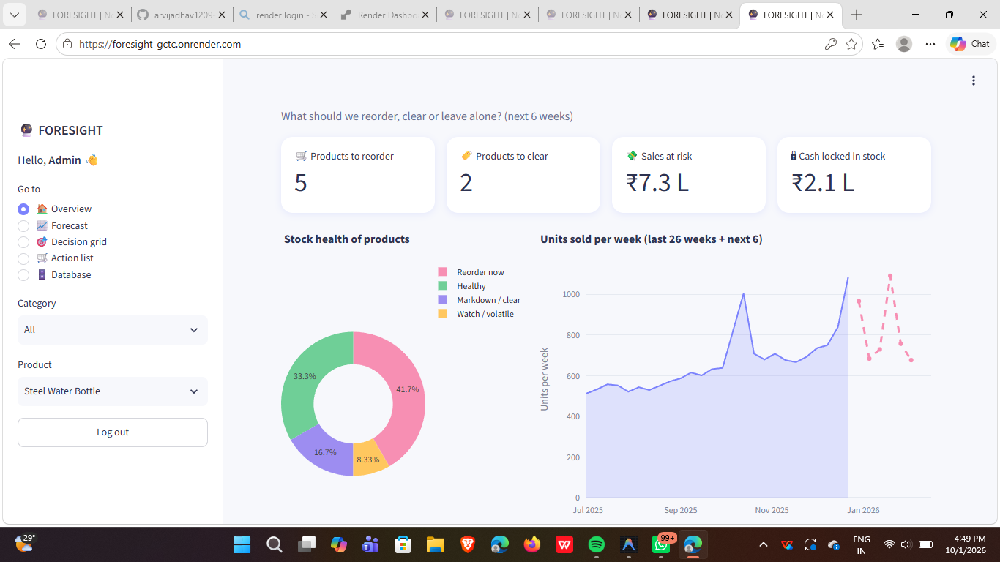
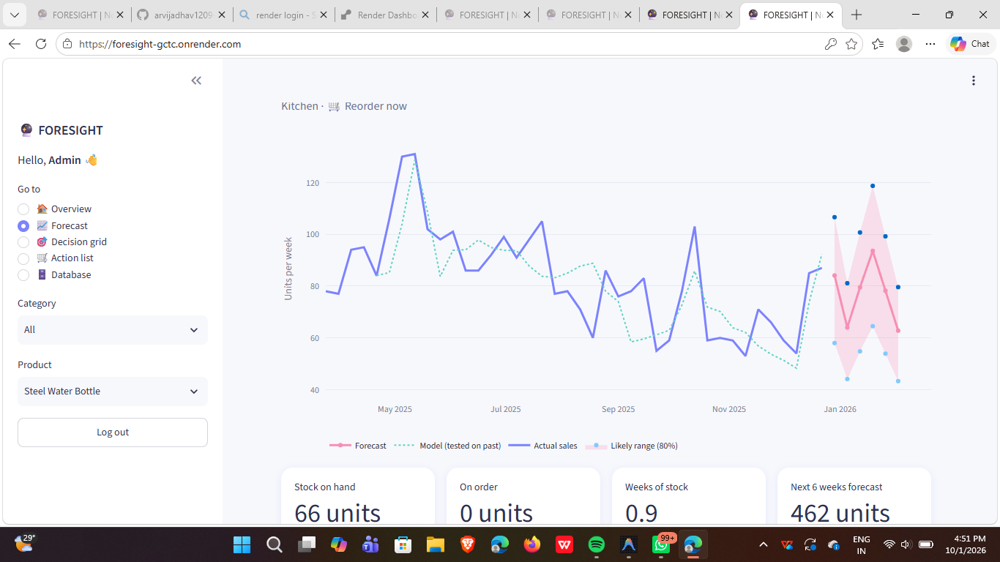

# 🔮 Project FORESIGHT – Demand & Inventory Intelligence (NorthBay Living)

[](https://foresight-gctc.onrender.com)
[](https://foresight-gctc.onrender.com)
[](PROJECT_REPORT.md)
[](https://github.com/arvijadhav1209-hub/foresight)

> 🚀 **Live Dashboard:** [https://foresight-gctc.onrender.com](https://foresight-gctc.onrender.com)  
> 📄 **Official Project Report:** [Read PROJECT_REPORT.md](PROJECT_REPORT.md) | [Download PDF](Project_FORESIGHT_Report_Arati_Jadhav.pdf)  
> ⏳ *Note: Render's free tier spins down after 15 minutes of inactivity; if sleeping, please allow ~30–50 seconds for the initial wake-up.*

### 🔑 Demo Login Credentials
| Role | Username | Password | Access Level |
|---|---|---|---|
| **Admin** | `admin` | `foresight123` | Full access, settings & audit |
| **Operations** | `ops` | `northbay2025` | Operations dashboard & planning |

Passwords are stored securely hashed (PBKDF2) in the SQLite `users` table.

---

Tells the operations team, for 12 everyday home products: **how much will sell in the next 6 weeks, which products will run out (reorder), and which are overstocked (clear).**

## 📸 Application Preview

### 1. Operations Overview Dashboard
Instant visibility into items needing immediate reorder, overstocked products, stock health breakdown, and quantified ₹ sales at risk:


### 2. 6-Week Forecast & Inventory Depth
Granular weekly forecasts comparing actual sales against machine learning predictions with 80% confidence intervals and stock-on-hand metrics:


---

## Quick start (Run Locally)
```bash
pip install -r requirements.txt
python run_pipeline.py        # one command: data -> clean -> forecast -> risk -> foresight.db
streamlit run app.py          # open the dashboard
```

## Folder map
| File | What it does |
|---|---|
| `src/generate_data.py` | Makes the small sample CSVs (12 products, 2 years). Replace `data/raw/*.csv` with Zidio's official files if provided. |
| `src/pipeline.py` | D1 – cleaning (duplicates, blanks, messy labels) + saves everything to SQLite |
| `src/forecast.py` | D3 – seasonal-naive baseline vs gradient boosting, rolling-origin backtest, WAPE |
| `src/risk.py` | D4 – stockout / overstock rules, recommended action, ₹ at stake |
| `app.py` | D5 – login + dashboard |

## Database (`foresight.db`)
`sales_daily`, `sku_master`, `calendar`, `inventory_snapshots` (cleaned inputs) → `weekly_sales` → `forecast`, `backtest`, `backtest_by_sku`, `metrics` → `risk`. Plus `data_quality` (issues found) and `users` (login).
Example: `SELECT product, sales_at_risk FROM risk ORDER BY sales_at_risk DESC;`

## Backtest result (seed 42, 6 rolling rounds × 6 weeks)
| | WAPE (lower is better) |
|---|---|
| Seasonal-naive baseline (same week last year) | 18.0% |
| Gradient boosting model | **14.5%** (≈19% better) |

No leakage: each feature uses only data up to the forecast date; promo/holiday plans are known in advance from the calendar. The model is only used if it beats the baseline.

## Risk rules (plain English)
- **Running out:** expected demand during delivery time + safety stock (90% service level) > stock on hand + on order → *Reorder now*.
- **Too much stock:** stock lasts > 6 weeks of forecast sales → *Markdown / clear*. Both true → *Watch*.

## Deploy (free)

### Option A: Render (Currently Deployed)
- **Live URL:** [https://foresight-gctc.onrender.com](https://foresight-gctc.onrender.com)
1. Go to [dashboard.render.com](https://dashboard.render.com) → **New +** → **Web Service** (or **Blueprint**).
2. Connect your GitHub repository `foresight`.
3. Set the following settings (automatically read if using Blueprint):
   - **Build Command:** `pip install -r requirements.txt`
   - **Start Command:** `streamlit run app.py --server.port $PORT --server.address 0.0.0.0`
4. Click **Deploy Web Service**.

### Option B: Streamlit Community Cloud
Push to GitHub → [share.streamlit.io](https://share.streamlit.io) → New app → select repo `arvijadhav1209-hub/foresight`, main file `app.py`. The database builds itself on first start.

## Assumptions
Sample data is synthetic (Zidio's brief says data is provided; this stands in for it). Lead times and reorder points are assumed accurate.
